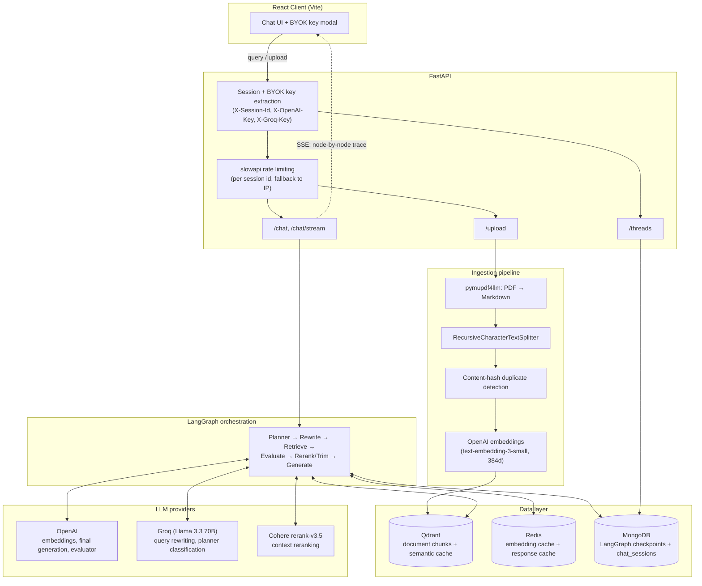
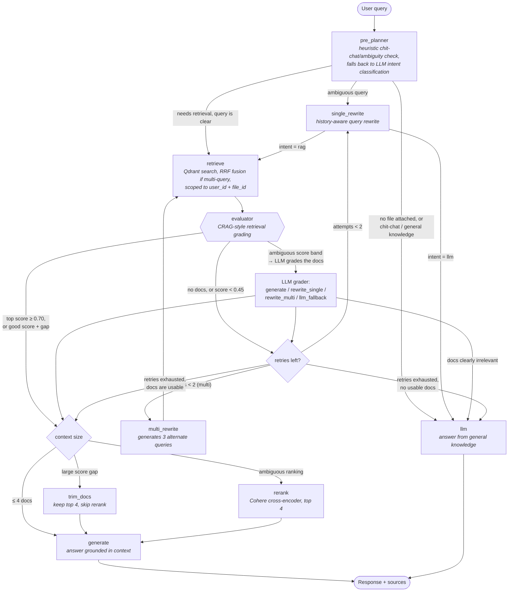
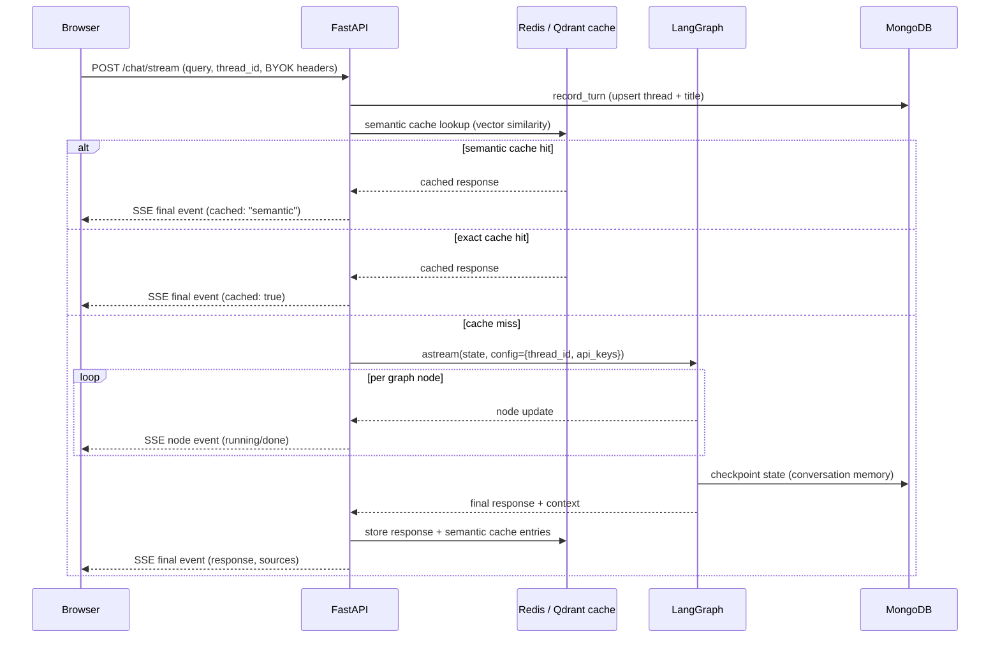

# Adaptive RAG

A Retrieval-Augmented Generation system that doesn't just retrieve-then-generate — it **plans** whether retrieval is needed, **rewrites** queries that won't retrieve well, **grades** what comes back (CRAG-style), and only then decides how to answer. Built with FastAPI, LangGraph, Qdrant, Redis, MongoDB, Cohere, and a React/Vite frontend.

**[Live demo →](https://adaptive-rag-1.vercel.app/)** 

It's a bring-your-own-key (BYOK) app — there's no login and no server-side inference cost. You supply an OpenAI key (required) and optionally a Groq key from a modal in the UI; the backend uses them per-request and never persists them.


---

## Why "adaptive" (and a touch of CRAG)

Most portfolio RAG projects hardcode the pipeline: embed the query, search the vector store, stuff the top-k into a prompt, generate. That works on the happy path and falls apart the moment a query doesn't need retrieval, is too vague to retrieve well, or retrieval comes back irrelevant.

This project treats each of those as a decision point instead of a fixed step:

- **Should we even retrieve?** A heuristic + LLM planner routes chit-chat and general-knowledge questions straight to the LLM, skipping retrieval entirely.
- **Is the query retrievable as-is?** Ambiguous queries ("what about it?") get rewritten using conversation history before they ever hit the vector store.
- **Was retrieval any good?** This is the CRAG-inspired part — a post-retrieval evaluator grades the retrieved context (not the query) using similarity-score heuristics first, falling back to an LLM grader only when the scores are ambiguous, and routes to *generate*, *rewrite and retry*, or *give up on retrieval and answer from general knowledge*.
- **Do we need to pay for reranking?** Only documents that are genuinely ambiguous in ranking get sent to a Cohere reranker; a clear score gap skips straight to generation.

The result is a graph, not a pipeline — built and executed with LangGraph.

---

## System architecture



---

## The LangGraph pipeline

This is the actual graph defined in `graphBuilder.py` — every node and every conditional edge below maps 1:1 to code.



**Loop protection:** `rewrite_attempts` is tracked in graph state and capped at `MAX_REWRITE_ATTEMPTS = 2` (a single constant shared by the evaluator and the router, so the two can't drift out of sync). Once exhausted, the evaluator stops paying for its own LLM grading call — its suggestion would just get overridden by the router anyway — and routes deterministically based on whether *any* usable context exists.

---

## Request flow: a chat message end-to-end



The frontend renders each `node` SSE event as a live pipeline trace ("Rewriting query…", "Evaluating retrieved context…", "Reranking…") so the adaptive routing is visible, not a black box.

---

## Retrieval-augmented caching (three layers)

| Layer | Store | Key | TTL | Purpose |
|---|---|---|---|---|
| Embedding cache | Redis | SHA-256 of text | none | Skip re-embedding identical text |
| Response cache | Redis | `user_id + file_id + query` (exact) | 10h | Skip the whole graph for repeated exact queries |
| Semantic cache | Qdrant (separate collection) | embedding similarity ≥ 0.72 | 10h | Skip the whole graph for *paraphrased* repeated queries |

The semantic cache is scoped by `user_id` and `file_id` — including explicitly requiring "no file attached" to match only other no-file entries, so a no-document chit-chat query can never get served an answer that was actually generated from someone's uploaded PDF. A background task (`cleanup_semantic_cache`) sweeps expired entries out of Qdrant every 10 minutes.

Responses are only cached when the evaluator's confidence is `None` (a direct LLM answer, not eval'd) or `> 0.6` — low-confidence RAG answers aren't cached, so a bad answer doesn't get served repeatedly.

---

## Multi-provider LLM routing

| Task | Provider | Why |
|---|---|---|
| Query rewriting (single + multi) | Groq (Llama 3.3 70B) | High-frequency orchestration step; fast and cheap |
| Planner intent classification | Groq (Llama 3.3 70B) | Same — only invoked when heuristics can't decide |
| Retrieval evaluation (LLM grader) | OpenAI (gpt-4.1-mini) | Only hit when similarity scores are ambiguous; worth the extra quality |
| Final answer generation | OpenAI (gpt-4.1-mini) | User-facing output — quality matters most here |
| Embeddings | OpenAI (text-embedding-3-small) | Truncated to 384 dims to keep Qdrant storage/compute small |
| Reranking | Cohere (rerank-v3.5) | Only called for ambiguous-ranking cases, not every query |

All LLM calls go through a single `generate_completion()` provider abstraction. If a Groq call is requested without a Groq key, it transparently falls back to OpenAI; if a Groq call *fails* (rate limit, outage), it also falls back to OpenAI rather than surfacing an error. Swapping in another provider (Anthropic, Gemini, a local model) means adding one branch in that one function — no graph node needs to know provider details.

---

## Identity & BYOK (not authentication)

There's no login. Each browser generates a random session id once (`localStorage`) and sends it as `X-Session-Id` on every request — this exists purely to keep one browser's uploads and chat history isolated from another's via Qdrant/Mongo payload filtering, not as an auth mechanism.

Inference is bring-your-own-key: `X-OpenAI-Key` (required) and `X-Groq-Key` (optional) headers are read fresh per request, passed through LangGraph's `configurable` channel, and used only for the duration of that request. They are never written to `GraphState` (which MongoDB checkpoints every turn), never logged, and never cached.

---

## Repository layout

```text
Backend/
└── app/
    ├── agent/graph/
    │   ├── graphBuilder.py        # wires nodes + conditional edges
    │   ├── keys.py                # extracts BYOK keys from RunnableConfig
    │   ├── nodes/                 # planner, rewrite (single/multi), retriever,
    │   │                          # evaluator, reranking, trim_docs, generate, llm
    │   └── routing/                # conditional-edge decision functions
    ├── api/v1/routes/             # chat, upload, threads, health
    ├── auth/session.py            # BYOK session id + API key extraction
    ├── cache/                     # embedding / response / semantic cache + cleanup task
    ├── config/                    # env config, provider clients, Qdrant/Redis/Mongo/limiter setup
    ├── ingestion/                 # PDF → markdown → chunks → embeddings
    ├── repository/                # Qdrant + chat_sessions persistence
    ├── retrieval/                 # vector search with payload filtering
    ├── schemas/                   # Pydantic request/response/state/thread models
    └── service/
        ├── chatService.py         # orchestrates cache → graph → SSE for a chat turn
        ├── graphRunner.py         # thread-id resolution + LangGraph run config
        ├── sse.py                 # SSE event formatting + node trace metadata
        ├── ingestService.py       # dedup check → parse → embed → store
        ├── rerankingService.py    # Cohere rerank wrapper with fallback
        └── threadService.py       # thread titles, message history for the sidebar

Frontend/
└── src/
    ├── components/
    │   ├── chat/                  # response feed, pipeline trace, doc/context panel, sidebar
    │   ├── landing/                # marketing landing page
    │   └── ui/                     # shadcn-style primitives
    ├── context/ApiKeysContext.jsx # BYOK key state + modal visibility
    ├── hooks/
    │   ├── useChat.js              # composes the hooks below
    │   ├── useChatStream.js        # SSE streaming + pipeline trace
    │   ├── useEntries.js           # chat feed state
    │   ├── useFileUpload.js        # PDF upload + ingestion status
    │   ├── useThreads.js           # thread list + loading a past conversation
    │   └── useApiHeaders.js        # BYOK request headers
    ├── lib/                        # session id, API key storage, thread API client, misc utils
    └── pages/                      # ChatPage, LandingPage
```

---

## Running locally

**Backend**
```bash
cd Backend
pip install -r requirements.txt
uvicorn app.main:app --reload
```

**Frontend**
```bash
cd Frontend
npm install
npm run dev
```

### Environment variables (Backend)

```env
QDRANT_URL=
QDRANT_API_KEY=
QDRANT_COLLECTION_NAME=
SEMANTIC_CACHE_COLLECTION_NAME=

MONGODB_URI=

REDIS_HOST=
REDIS_PORT=
REDIS_PASSWORD=

COHERE_API_KEY=

CORS_ORIGINS=http://localhost:5173,http://localhost:5174
```

Note: OpenAI and Groq keys are **not** server env vars — they're supplied per-request by the client via BYOK headers.

### Environment variables (Frontend)

```env
VITE_API_BASE_URL=http://127.0.0.1:8000/api/v1
```

---

## What this project demonstrates

- **Adaptive orchestration over a fixed pipeline** — LangGraph state machine with conditional routing at three separate decision points (plan, evaluate, rerank-or-not), not a linear retrieve→generate chain.
- **CRAG-style retrieval grading** — grading the *evidence* before generating, with a cheap heuristic path and an LLM-grader fallback only when needed.
- **Cost-aware multi-provider inference** — fast/cheap provider for high-frequency orchestration calls, higher-quality provider reserved for user-facing output, with automatic fallback.
- **Layered caching** — embedding, exact-response, and semantic caches, each with an appropriate TTL and scope, plus a background expiry sweep.
- **Correct multi-user isolation without real auth** — BYOK session model with retrieval-time payload filtering by `user_id`/`file_id`, and cache-scoping bugs (e.g. no-file queries matching file-scoped cache entries) treated as seriously as auth bugs would be.
- **Streaming transparency** — SSE node-by-node trace so the adaptive decisions are visible to the end user in real time, not just in server logs.