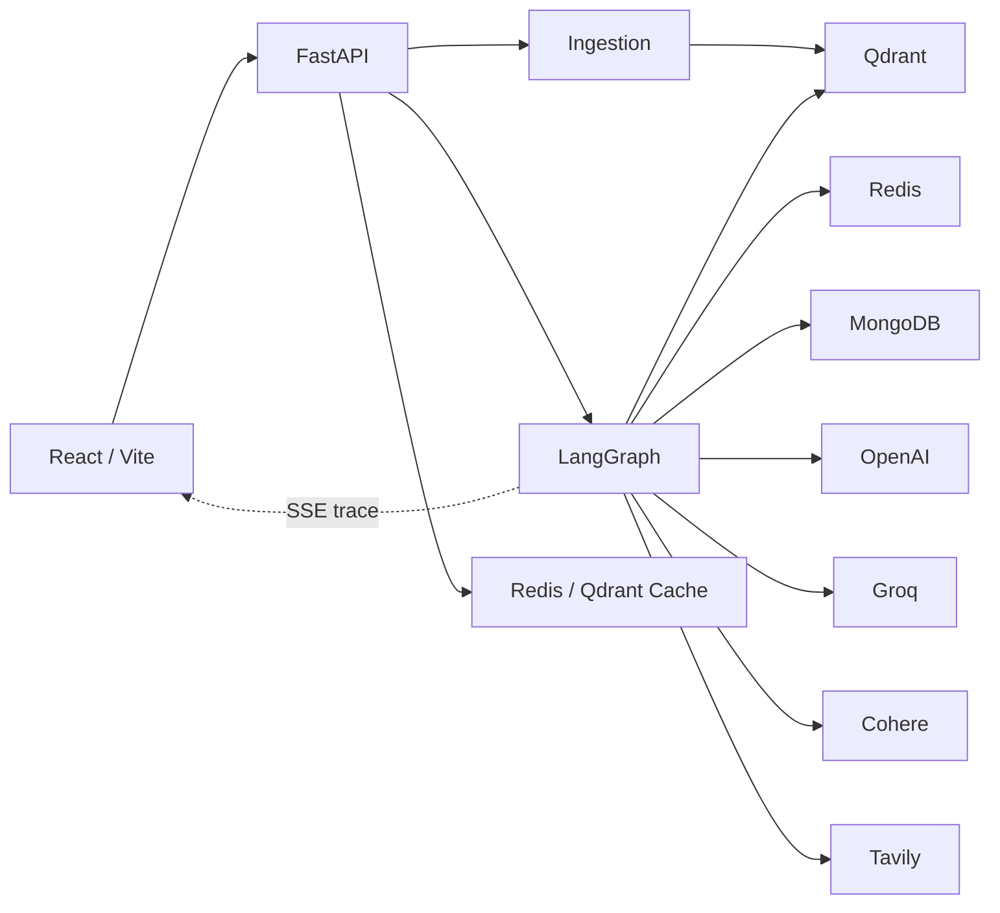
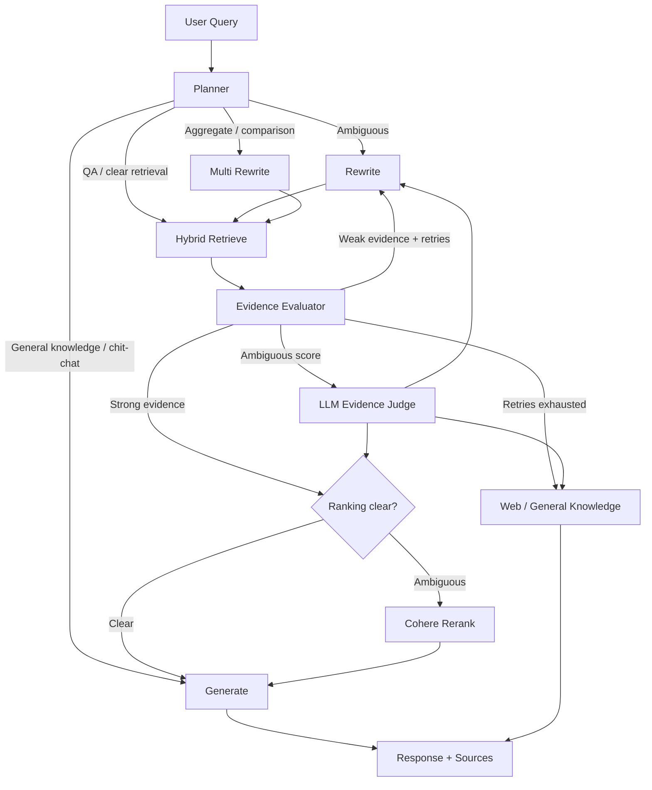
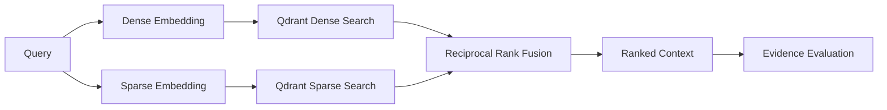
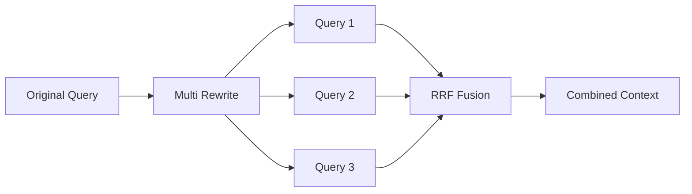
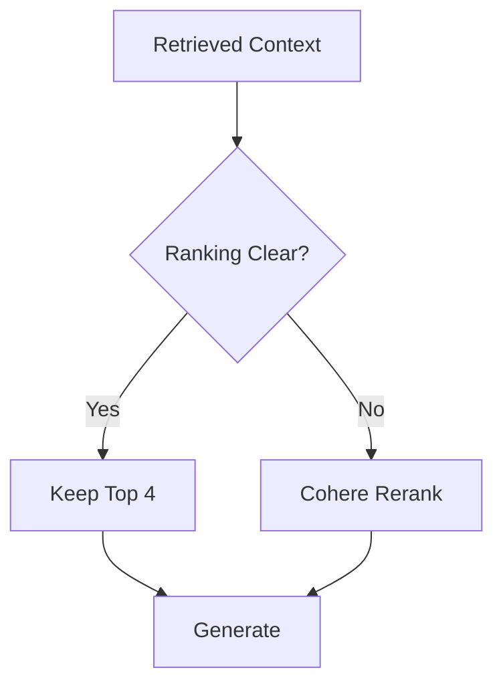
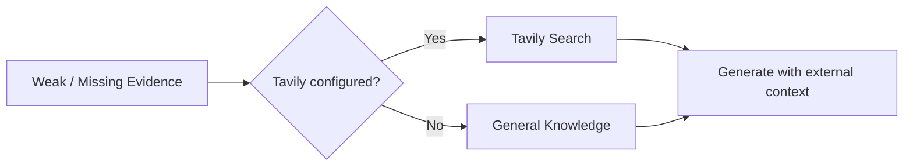

# Adaptive RAG

A production-oriented Retrieval-Augmented Generation system that treats retrieval as a **decision process rather than a fixed retrieve → generate pipeline**.

The system dynamically decides whether retrieval is required, classifies the task, rewrites weak queries, performs hybrid dense+sparse retrieval, evaluates retrieved evidence, conditionally reranks, and falls back to web search or general knowledge when appropriate.

**Live Demo:** https://adaptive-rag-1.vercel.app/


---

## Impact

| Area | Result |
|---|---|
| Routing correctness | **7/7 scenarios passed** against real graph traces |
| Faithfulness | **0.93** mean on 8-case Ragas golden set |
| Answer relevancy | **0.92** mean |
| Context precision | **0.87** mean |
| Context recall | **0.94** mean |
| Deployment constraint | Runs within **Render's 512 MB** memory budget |
| Reliability | OpenAI, Groq, Cohere, and Qdrant calls share bounded exponential-backoff retry handling |
| Memory efficiency | Streaming upload path avoids buffering entire files in memory |
| Observability | Node-level SSE execution trace plus LangSmith tracing support |

The evaluation suite is separated into routing correctness and answer/retrieval quality so failures can be attributed to the orchestration layer or the RAG quality layer independently.

---

## Table of Contents

- [System Architecture](#system-architecture)
- [Engineering Highlights & Reliability](#engineering-highlights--reliability)
- [Evaluation & Observability](#evaluation--observability)
- [Local Setup & Repository Structure](#local-setup--repository-structure)

---

## System Architecture

### Request and Data Flow
---


--- 
---
### Adaptive Routing
---

---
---
### Retrieval
---

---
---
**Core behavior**

- Planner distinguishes **general knowledge, QA, summarization, and aggregate/comparison** tasks.
- Single-query rewriting is history-aware; multi-query rewriting produces three retrieval variants.
- Dense and sparse searches run concurrently and are fused with **RRF**, avoiding incompatible-score normalization.
- Retrieval is scoped by `user_id` and `file_id`.
- Evidence is evaluated before generation using score heuristics, with an LLM grader only for ambiguous cases.
- Cohere reranking is invoked only when ranking is genuinely ambiguous.
- Rewrite attempts are capped at **2** to bound latency and inference cost.
- Tavily provides an optional external retrieval fallback when document evidence is insufficient.
- Summarization uses a document-level condensation path rather than ordinary top-k QA.

---

## Engineering Highlights & Reliability

### Memory-Constrained Deployment

The backend is deployed under Render's **512 MB memory constraint**, which drove several concrete optimizations:

- **Streaming uploads:** files are read and hashed in 1 MB chunks instead of buffering the complete upload in memory; oversized partial files are cleaned up.
- **Non-blocking document processing:** CPU-bound PDF parsing and chunking run through `asyncio.to_thread` rather than blocking the FastAPI event loop.
- **Background task lifetime:** ingestion tasks retain a strong reference until completion so asynchronous work cannot silently disappear.
- **Evaluation isolation:** Ragas dependencies remain in `evaluation/requirements-eval.txt` and are excluded from the production image.

### Three-Layer Caching

| Layer | Store | Key / Condition | TTL |
|---|---|---|---:|
| Embedding | Redis | SHA-256(text) | — |
| Exact response | Redis | `user_id + file_id + query` | 10h |
| Semantic response | Qdrant | Similarity **≥ 0.72** | 10h |

Semantic cache entries are explicitly scoped to the same document context, including a separate no-file case. Low-confidence responses are not cached, and expired semantic entries are cleaned periodically.

### BYOK and Isolation

- OpenAI key is required; Groq key is optional.
- Keys are supplied per request and passed through LangGraph's `configurable` runtime channel.
- Inference credentials are **not persisted in MongoDB checkpoints, logged, or cached**.
- Browser session IDs isolate uploads, threads, and retrieval through `user_id` filters; they are **not treated as authentication**.

### Provider Strategy

Provider selection is workload-specific rather than one-model-for-everything:

| Workload | Provider | Engineering rationale |
|---|---|---|
| Planner / intent classification | Groq — Llama 3.3 70B | Fast, high-frequency orchestration; heuristics avoid the call when possible |
| Single + multi-query rewriting | Groq — Llama 3.3 70B | Low-latency query transformation |
| Retrieval evidence grading | OpenAI — gpt-4.1-mini | Higher-quality judgment, invoked only for ambiguous retrieval scores |
| Final generation | OpenAI — gpt-4.1-mini | User-facing quality and grounding |
| Dense embeddings | OpenAI — text-embedding-3-small | Semantic retrieval |
| Reranking | Cohere — rerank-v3.5 | Cross-encoder relevance scoring, conditionally invoked |
| Web fallback | Tavily | External evidence when document retrieval cannot produce usable context |

All model calls are routed through a provider abstraction. Groq failures or missing Groq configuration can fall back to OpenAI without requiring graph nodes to know provider-specific details.

### Security and Reliability

- **BYOK isolation:** OpenAI/Groq keys are request-scoped through LangGraph `configurable`; they are not persisted in MongoDB checkpoints, logged, or cached.
- **Session isolation:** browser session IDs scope Qdrant and MongoDB data; they are explicitly **not authentication**.
- **Prompt-injection boundary:** retrieved documents and web results are treated as untrusted data rather than executable instructions.
- **External-call resilience:** OpenAI, Groq, Cohere, and Qdrant use shared exponential-backoff retry handling for transient `5xx`, `429`, and connection failures; permanent `4xx` errors are not blindly retried.
- **Bounded graph recovery:** rewrite attempts are capped at **2**, preventing runaway latency/cost.
- **API protection:** rate limiting and `/api/v1/health` support production request safety and health checks.
- **Container hardening:** multi-stage Docker build, non-root runtime, and runtime-only dependencies.
- **Resource-aware execution:** CPU-bound PDF parsing/chunking runs through `asyncio.to_thread`; uploads stream to disk in 1 MB chunks.
- **Background-task safety:** ingestion tasks retain strong references until completion, preventing asynchronous work from disappearing silently.

### Streaming and Persistence

- SSE exposes `status`, cache-hit, node execution, final response, source, confidence, and error events.
- The frontend renders node execution as a live pipeline trace.
- MongoDB stores conversation threads and LangGraph checkpoints.
- Reopening a thread restores message history and document context.
- Ingestion supports PDF, TXT, and DOCX sources with content-hash deduplication.
- Chunk overlap is deduplicated before vector storage.

---

### Query Rewriting

Rewriting is a recovery mechanism, not a default preprocessing step.

- **Single rewrite:** history-aware reformulation for ambiguous or weak queries.
- **Multi rewrite:** generates three retrieval variants for aggregate/comparison requests.
- Rewritten queries are independently retrieved and fused with the same RRF mechanism.




- A shared `MAX_REWRITE_ATTEMPTS = 2` bounds recovery cost and keeps evaluator/router behavior synchronized.

### Conditional Reranking

Reranking is deliberately not applied to every request.

After evidence evaluation:



If there are four or fewer usable documents, generation proceeds directly.

If more documents are available and the top scores have a clear separation, the system trims to the strongest four.

Only ambiguous rankings invoke Cohere `rerank-v3.5`.

This keeps the quality improvement of cross-encoder reranking without imposing its cost and latency on every query.

### Summarization and Aggregate Queries

The planner routes document tasks by workload instead of treating every request as top-k QA:

- **Summarization:** document chunks → section summaries → reduction → final response, preserving names, numbers, and key facts.
- **Aggregate/comparison:** multi-query fan-out retrieves evidence distributed across different document sections before fusion and generation.
- This prevents narrow top-k retrieval from becoming the bottleneck for questions requiring document-wide evidence.

### Web Search Fallback

Tavily is an optional fallback path, reached only when document retrieval cannot produce usable evidence.



The routing evaluation treats the Tavily branch dynamically, validating the branch actually available in the test environment rather than hardcoding one deployment configuration.

### Retrieval Evaluation

Retrieval is evaluated before generation:

1. Dense + sparse retrieval produces candidate evidence.
2. Score heuristics classify evidence as strong, weak, or ambiguous.
3. Ambiguous cases invoke an LLM evidence grader.
4. The evaluator chooses **generate, rewrite/retry, or fallback**.
5. Ranking ambiguity separately determines whether Cohere reranking is necessary.

This separates **retrieval failure** from **generation failure** and avoids paying for an LLM judge on every request.
---
## Evaluation & Observability

### 1. Routing Evaluation

`run_routing_eval.py` executes the **real compiled graph** and asserts against state and node traces rather than judging the final answer.

| Scenario | Expected behavior | Result |
|---|---|---|
| Clear QA | Retrieve → evaluate → generate | ✅ |
| Cross-section comparison | Multi-rewrite → retrieve → rerank → generate | ✅ |
| Summarization | Summary path; retrieval skipped | ✅ |
| Missing document evidence | Rewrite exhaustion → fallback | ✅ |
| General knowledge, no file | Retrieval skipped | ✅ |
| Chit-chat | Retrieval skipped | ✅ |
| Ambiguous reference | Rewrite before retrieval | ✅ |

**Latest result: 7/7 passed.**

The fallback case is environment-aware: the test validates the branch against whether Tavily is actually configured instead of hardcoding an environment-specific result.

### 2. Ragas Quality Evaluation

`run_ragas_eval.py` runs an **8-case golden set through the real graph** and evaluates:

- **Faithfulness:** answer claims supported by retrieved context.
- **Answer relevancy:** whether the answer addresses the question.
- **Context precision:** relevance of retrieved context.
- **Context recall:** whether required evidence was retrieved.

| Metric | Mean |
|---|---:|
| Faithfulness | **0.932** |
| Answer relevancy | **0.916** |
| Context precision | **0.875** |
| Context recall | **0.938** |

The Ragas judge makes separate evaluation-model calls from the graph's own generation calls.

Per-case results are retained so aggregate scores do not hide individual failure modes. For example, the comparison case exposes a low context-precision score because the query legitimately requires evidence from multiple document sections, while the prorated-PTO case exposes a faithfulness issue caused by an inference not explicitly stated in the source.

Evaluation fixtures are ingested through the **same production ingestion path**, including chunking, embeddings, and Qdrant storage.

### 3. LangSmith Tracing

LangSmith tracing can expose actual graph execution, nested model calls, latency, and routing behavior.

**[Screenshot placeholder — LangSmith multi-node trace]**

```md

```

**[Screenshot placeholder — LangSmith run details / latency]**

```md

```

A rewrite → retry or fallback trace is the most useful demonstration because it proves the adaptive branches shown in the architecture are exercised in real execution.

---

## Local Setup & Repository Structure

### Backend

```bash
cd Backend
python -m venv venv
pip install -r requirements.txt
uvicorn app.main:app --reload
```

### Frontend

```bash
cd Frontend
npm install
npm run dev
```

### Environment

```env
QDRANT_URL=
QDRANT_API_KEY=
QDRANT_COLLECTION_NAME=
SEMANTIC_CACHE_COLLECTION_NAME=

MONGODB_URI=

REDIS_HOST=
REDIS_PORT=
REDIS_PASSWORD=

COHERE_API_KEY=
TAVILY_API_KEY=

CORS_ORIGINS=http://localhost:5173
LANGSMITH_API_KEY=
LANGSMITH_TRACING=false
LANGSMITH_PROJECT=Adaptive RAG
```

OpenAI and Groq inference keys are supplied through the BYOK request flow rather than stored as server-side inference credentials.

Frontend:

```env
VITE_API_BASE_URL=http://127.0.0.1:8000/api/v1
```

### Evaluation

```bash
cd Backend

python -m evaluation.seed_fixtures
python -m evaluation.run_routing_eval

pip install -r evaluation/requirements-eval.txt
python -m evaluation.run_ragas_eval
```

### Repository Structure

```text
Backend/
├── app/
│   ├── agent/
│   │   ├── graph/
│   │   │   ├── graphBuilder.py        # wires nodes + conditional edges
│   │   │   ├── nodes/                 # planner, rewrite, retrieval, evaluation,
│   │   │   │                          # reranking, summarization, generation
│   │   │   └── routing/               # conditional-edge decision functions
│   │   ├── prompts/                   # prompts isolated from graph logic
│   │   └── tools/                     # external retrieval / agent tools
│   │
│   ├── api/v1/routes/                 # chat, upload, threads, health
│   ├── auth/                           # session and BYOK key handling
│   ├── cache/                          # embedding, response, semantic cache + cleanup
│   ├── config/                         # environment, providers, database configuration
│   ├── ingestion/                      # parse → chunk → dense + sparse embeddings
│   ├── retrieval/                      # hybrid search + RRF fusion
│   ├── repository/                     # Qdrant + MongoDB persistence
│   ├── schemas/                        # Pydantic request, response, and graph state models
│   ├── service/                        # chat orchestration, SSE, provider routing
│   └── utils/                          # shared retry and utility logic
│
├── evaluation/
│   ├── run_routing_eval.py             # graph-path correctness
│   ├── run_ragas_eval.py               # retrieval + answer quality
│   ├── seed_fixtures.py                # seeds evaluation documents
│   ├── cases/                          # routing cases + Ragas golden set
│   └── results/latest/                 # latest evaluation results
│
└── Dockerfile                          # production multi-stage image

Frontend/
└── src/
    ├── components/
    │   └── chat/                       # response feed, pipeline trace, sidebar
    ├── hooks/                          # SSE streaming, threads, uploads
    ├── context/                        # BYOK/API key state
    └── pages/                          # ChatPage, LandingPage
```

### Technology Stack

**Backend:** Python 3.11, FastAPI, LangGraph, LangChain, Qdrant, Redis, MongoDB, slowapi, pymupdf4llm, tenacity

**LLM / Retrieval:** OpenAI, Groq, Cohere, Tavily, dense + sparse retrieval, RRF

**Evaluation:** Ragas, deterministic routing-trace assertions

**Frontend:** React 19, Vite, Tailwind CSS 4, React Router, Axios, react-markdown

**Infrastructure:** Docker, Vercel, Render, Qdrant, Redis, MongoDB, LangSmith
